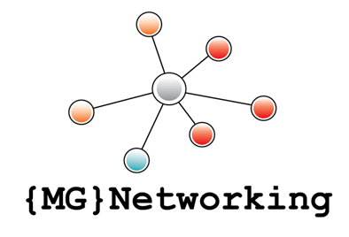

<!-- Sticky Navigation -->

  

    <a href="#ueber-mich">Über mich</a>
    <a href="#leistungen">Leistungen</a>
    <a href="#pakete">Pakete</a>
    <a href="#technologien">Technologien</a>
    <a href="#kontakt">Kontakt</a>
  

<!-- Header -->

  

<h1 align="center">MG – Networking</h1>
<h3 align="center">Softwareentwicklung • Technical Scrum Master (PSM II) • Agile Delivery</h3>

---

## Über mich {#ueber-mich}

Ich bin Michael, Softwareentwickler und zertifizierter Scrum Master (PSM II).  
Meine Stärke liegt in der Kombination aus technischer Tiefe und agiler Führung.

Ich helfe Teams dabei, bessere Software schneller zu liefern – durch klare Prozesse, moderne Entwicklungspraktiken und pragmatische Lösungen.

---

## Leistungen {#leistungen}

### Technical Scrum Master
- Moderation von Scrum‑Events  
- Coaching von Teams & Product Ownern  
- Verbesserung von Flow, Kommunikation & Zusammenarbeit  
- Einführung sinnvoller Metriken (Lead Time, Deployment Frequency)

### Softwareentwicklung
- Backend‑Entwicklung  
- API‑Design  
- CI/CD‑Optimierung  
- Testautomatisierung  
- Refactoring & technische Schulden reduzieren

### Hybrid‑Rolle: Technical Scrum Master + Developer
- technische Risiken früh erkennen  
- Architekturentscheidungen begleiten  
- Qualität & Delivery verbessern  
- Teams technisch UND organisatorisch stärken

---

## Pakete {#pakete}

### Scrum Health Check (2–4 Stunden)
Analyse von Team, Prozessen und technischen Bottlenecks.  
**Ergebnis:** konkrete Handlungsempfehlungen.

### Agile Coaching Light (5–10 Std/Monat)
Regelmäßige Unterstützung ohne Full‑Time‑Scrum‑Master.

### Developer‑Support
Bugfixing, Refactoring, CI/CD‑Verbesserungen, technische Schulden abbauen.

### Workshops
- Scrum Basics  
- Agile Leadership  
- Clean Code  
- Testautomatisierung  
- DevOps Grundlagen

---

## Technologien & Tools {#technologien}

- Scrum, Kanban, Agile Coaching  
- CI/CD (Azure DevOps, GitHub Actions, GitLab CI)  
- Testing & Testautomatisierung  
- Clean Code, Refactoring  
- API‑Design  
- Docker, Git, Cloud‑Basics

---

## Kontakt {#kontakt}

📧 E-Mail: deine@mail.de  
🔗 LinkedIn: https://linkedin.com/in/deinprofil  
📍 Standort: Wendlingen am Neckar, Deutschland

---

© 2026 MG – Networking
